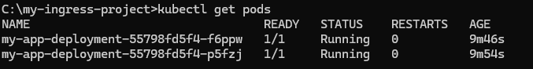
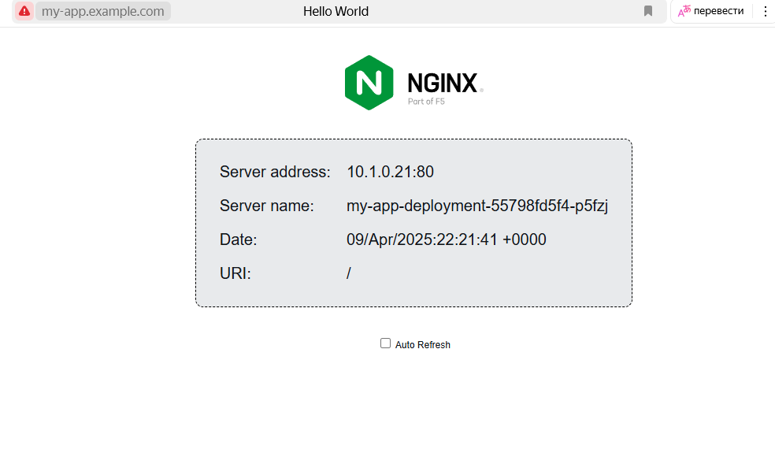

# Лабораторная работа №5 по курсу «Технологии сетевого взаимодействия»
# Выполнил студент группы М80-209М-23 Брежнев В.А.
Задание - Создать сервис, который будет привязан к хостовому посту и задеплоить с использованием ingress

Этот репозиторий содержит манифесты Kubernetes для развертывания простого веб-приложения с использованием NGINX Ingress Controller. Приложение использует образ nginxdemos/hello, который предоставляет тестовую HTML-страницу.

Инструкция по развертыванию:
1. Установка NGINX Ingress Controller и проверка подов
kubectl apply -f https://raw.githubusercontent.com/kubernetes/ingress-nginx/main/deploy/static/provider/cloud/deploy.yaml
kubectl get pods -n ingress-nginx
2. Применение манифестов
kubectl apply -f deployment.yaml
kubectl apply -f service.yaml
kubectl apply -f ingress.yaml
3. Настройка DNS
Добавить запись в файл, открыв от имени администратора C:\Windows\System32\drivers\etc\hosts (для Windows)
127.0.0.1 my-app.example.com
4. Тестирование
Проверка подов kubectl get pods

Проверка доступности через Service - временный под kubectl run -i --tty --rm debug --image=busybox --restart=Never -- sh внутри контейнера команда wget -qO- http://my-app-service.default.svc.cluster.local:80
5. Открытие страницы
http://my-app.example.com
